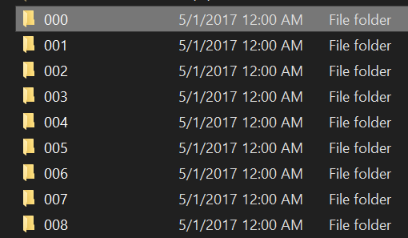
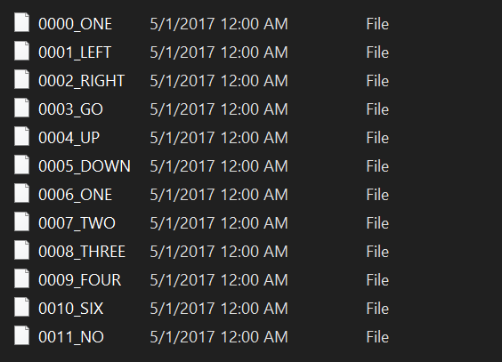
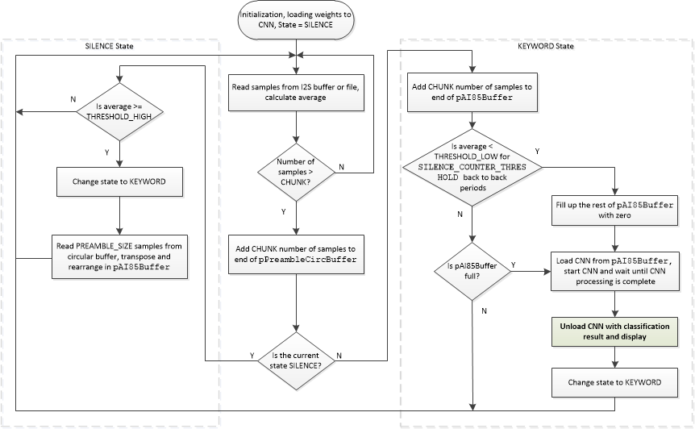

# Benchmark MAX78000


## Overview

This Statistical Benchmarking project is designed to optimize the performance of a Neural Architecture Search. This project is automated through the Ultility/smu_sequential_power.py file, which communicates with the MAX78000 and Keysight B2901A through serial.

Running Utility/smu_sequential_power.py runs individual inferences from the on-board SD Card, saving the power consumption and returned logit/latency from the inference to the results folder in CSV format.

The MAX78000 must be Flashed with main.c prior to Utility/running smu_sequential_power.py.

The current state of the CNN on the Benchmark uses the Keyword Spotting Demo, described below:

The Keyword Spotting Demo software demonstrates recognition of a number of keywords using MAX78000 EVKIT.  

The KWS20 demo software utilizes 2nd version of the Google speech commands dataset which consists of 35 keywords and more than 100K utterances:

https://storage.cloud.google.com/download.tensorflow.org/data/speech_commands_v0.02.tar.gz

The following 20 keyword subset from the complete dataset is used for this demo:

 ['**up', 'down', 'left', 'right', 'stop', 'go', 'yes', 'no', 'on', 'off', 'one', 'two', 'three', 'four', 'five', 'six', 'seven', 'eight', 'nine', 'zero**']

The rest of the keywords and unrecognized words fall into the "**Unknown**" category. 

To improve the unknown detection, the model in version 3.2 is trained with an additional speech dataset from LibriSpeech (http://us.openslr.org/resources/12/dev-clean.tar.gz), segmented to 1-sec audio data and labeled as unknown.

## Software

### Project Usage

Universal instructions on building, flashing, and debugging this project can be found in the **[MSDK User Guide](https://analogdevicesinc.github.io/msdk/USERGUIDE/)**.

### Project-Specific Build Notes

### MAX78000 Benchmark Operations

The Benchmark is preconfigured to read binary vectors located in the "bin" file from the SD Card. The on-board microphone is turned off, due to statistical variability in real-time audio. 

## CNN Model
**planned to change to cough model in Spring 2025**
The KWS20 v.3 Convolutional Neural Network (CNN) model consists of **1D** CNN with 8 layers and one fully connected layer to recognize keywords from 20 words dictionary used for training.

```python
class AI85KWS20Netv3(nn.Module):
    """
    Compound KWS20 v3 Audio net, all with Conv1Ds
    """

    # num_classes = n keywords + 1 unknown
    def __init__(
            self,
            num_classes=21,
            num_channels=128,
            dimensions=(128, 1),  # pylint: disable=unused-argument
            bias=False,
            **kwargs

    ):
        super().__init__()
        self.drop = nn.Dropout(p=0.2)
        # Time: 128 Feature :128
        self.voice_conv1 = ai8x.FusedConv1dReLU(num_channels, 100, 1, 
                                                stride=1, padding=0,
                                                bias=bias, **kwargs)
        # T: 128 F: 100
        self.voice_conv2 = ai8x.FusedConv1dReLU(100, 96, 3, 
                                                stride=1, padding=0,
                                                bias=bias, **kwargs)
        # T: 126 F : 96
        self.voice_conv3 = ai8x.FusedMaxPoolConv1dReLU(96, 64, 3, 
                                                       stride=1, padding=1,
                                                       bias=bias, **kwargs)
        # T: 62 F : 64
        self.voice_conv4 = ai8x.FusedConv1dReLU(64, 48, 3, 
                                                stride=1, padding=0,
                                                bias=bias, **kwargs)
        # T : 60 F : 48
        self.kws_conv1 = ai8x.FusedMaxPoolConv1dReLU(48, 64, 3, 
                                                     stride=1, padding=1,
                                                     bias=bias, **kwargs)
        # T: 30 F : 64
        self.kws_conv2 = ai8x.FusedConv1dReLU(64, 96, 3, 
                                              stride=1, padding=0,
                                              bias=bias, **kwargs)
        # T: 28 F : 96
        self.kws_conv3 = ai8x.FusedAvgPoolConv1dReLU(96, 100, 3, 
                                                     stride=1, padding=1,
                                                     bias=bias, **kwargs)
        # T : 14 F: 100
        self.kws_conv4 = ai8x.FusedMaxPoolConv1dReLU(100, 64, 6, 
                                                     stride=1, padding=1,
                                                     bias=bias, **kwargs)
        # T : 2 F: 128
        self.fc = ai8x.Linear(256, num_classes, bias=bias, wide=True, **kwargs)

    def forward(self, x):  # pylint: disable=arguments-differ
        """Forward prop"""
        # Run CNN
        x = self.voice_conv1(x)
        x = self.voice_conv2(x)
        x = self.drop(x)
        x = self.voice_conv3(x)
        x = self.voice_conv4(x)
        x = self.drop(x)
        x = self.kws_conv1(x)
        x = self.kws_conv2(x)
        x = self.drop(x)
        x = self.kws_conv3(x)
        x = self.kws_conv4(x)
        x = x.view(x.size(0), -1)
        x = self.fc(x)

        return x
```

The CNN input is 128x128=16384 8-bit signed speech samples.

## Network Training

To invoke network training execute the script:

```bash
(ai8x-training) $ ./scripts/train_kws20_v3.sh
```

If this is the first time, and the dataset does not exist locally, the scrip will automatically download the Google speech commands dataset (1-second keyword .wav files, sampled at 16KHz, 16-bit) into /data/KWS/raw, and process it to make appropriate training, test and validation dataset integrated into /data/KWS/process/dataset2.pt. To improve the detection of unknown keywords, it also downloads an additional speech dataset from librispeech and segments them into 1-second audio files to be labeled as unknown. The processing step expands the training dataset by using augmentation techniques like adding white noise, random time shift, and stretch to improve training results. In addition, each 16000 sample word example is padded with zeros to make it 128x128=16384 speech samples. The augmentation process triples the size of the dataset and could take 30min to complete.

Details of network training methodology are described in [AI8X Model Training and Quantization](https://github.com/MaximIntegratedAI/ai8x-synthesis/blob/master/README.md)

After training unquantized network can be evaluated by executing the script:

```bash
(ai8x-training) $ ./scripts/evaluate_kws20_v3.sh
```


## Network Quantization

The CNN weights generated during training need to be quantized:

```bash
(ai8x-synthesis) $ ./scripts/quantize_kws20_v3.sh
```

Details of quantization are described in [AI8X Model Training and Quantization](https://github.com/MaximIntegratedAI/ai8x-synthesis/blob/master/README.md)

## Network Synthesis

The network synthesis script generates a pass/fail C example code which includes necessary functions to initialize the MAX78000 CNN accelerator, load quantized CNN weights and input samples, and unload classification results. A sample input with the expected result is part of this automatically generated code to verify.  The following script generates all example projects including **kws20_v3**:

```bash
(ai8x-synthesis) $ ./gen-demos-max78000.sh
```
### CODEC Mode
Record .wav files using the on-board microphone
In this mode, the left channel (tip of the J5 3.5mm audio jack) of the line-in of MAX9867 audio CODEC (is used as the audio input source).  This mode is only supported on the MAX78000FTHR.  See the [build notes](#project-specific-build-notes) for instructions on enabling this feature.

```bash
# record 1sec of 16-bit 16KHz sampled wav file 
$ python VoiceRecorder.py -d 1 -o voicefile.wav
# convert to header
$ python RealtimeAudio.py -i voicefile.wav -o voicefile.h
```

### Saving Sound Snippets to SD Card

A new sequential directory is created on the SD card on every power-up or reset.  This is only supported on the MAX78000FTHR.  See [build notes](#project-specific-build-notes) for instructions on enabling this feature.



After a few moments, the green LED lights up and upon detecting a new word, the LED blinks and a file is created with 8-bit sample recorded audio. The file name includes an index and the detected word. If the detection has low confidence, the file name will have a "_L" suffix. (for example `0003_RIGHT_L`)



The LED

- stays *green* when it is listening
- blinks *green* if a keyword is detected
- blinks *yellow* if detection confidence is low or unknown keyword
- stays *red* if there is an error in the SD card interface

A utility (`bin2wav.py`) is provided in the `/Utility` folder to convert these files into wave (.wav) format to listen to.
To convert individual files:

```bash
$ python bin2wav.py -i <sound snippet file>
```

To convert all the files in the current directory and all subdirectories:

```bash
$ python bin2wav.py -a
```

To convert all the files in a directory and all its subdirectories:

```bash
$ python bin2wav.py -a -d <folder name>
```

When option `-a` is used, each file is converted to a .wav file once and subsequent execution of the command skips all the files that have previously been converted to wave files.

***Note 1: When `SEND_MIC_OUT_SDCARD` is selected, the Wake-Up Timer (WUT) is disabled.***

***Note 2: When `SEND_MIC_OUT_SDCARD` is selected, the `TFT_ENABLE` is disabled regardless of make options.***

### Sending Sound Snippets to serial

If `SEND_MIC_OUT_SERIAL` is defined the example will send audio snippets to the serial port in binary format.  See [build notes](#project-specific-build-notes) for instructions on enabling this feature.

A utility (`capture_serial_bin.py`) is provided in the `/Utility` folder to capture the serial snippets and save them as  .wav files:

```bash
$ python capture_serial_bin.py -c COM3 -o out.wav
```

The snippets will be stored with incremental tags.

### KWS20 Demo Firmware Structure

The following figure shows the processing in KWS20 Demo firmware:



Collected samples from mic/file are 18/16 bit signed and are converted to 8-bit signed to feed into CNN. In Microphone mode, a high pass filter filters out the DC level in captured samples. Scaled samples are stored in **micBuff** circular buffer in 128 sample (bytes) chunks. 

The following parameters in the firmware can be tuned:

```c
#define SAMPLE_SCALE_FACTOR    		4		// multiplies 16-bit samples by this scale factor before converting to 8-bit
#define THRESHOLD_HIGH				350  	// voice detection threshold to find beginning of a keyword
#define THRESHOLD_LOW				100  	// voice detection threshold to find end of a keyword
#define SILENCE_COUNTER_THRESHOLD 	20 		// [>20] number of back to back CHUNK periods with avg < THRESHOLD_LOW to declare the end of a word
#define PREAMBLE_SIZE				30*CHUNK// how many samples before beginning of a keyword to include
#define INFERENCE_THRESHOLD   		49 		// min probability (0-100) to accept an inference
```

(defined in [main.c](main.c))

The beginning of an utterance is marked when the average absolute values of samples during the last 128 samples go above a threshold.

The end of a word is signaled when the **SILENCE_COUNTER_THRESHOLD** back-to-back chunks of samples with an average absolute threshold lower than **THRESHOLD_LOW** are observed. 

The CNN requires 1sec worth of samples (128*128) to start processing. This window starts at **PREAMBLE_SIZE** samples before the beginning of the word and ends after 16384 samples. If the end of a word is determined earlier, the pAI85Buffer sample buffer is padded with zeros.

The CNN-related API functions are in **cnn.c**. They are used to load weights and data, start CNN, wait for CNN to complete processing, and unload the result. 

If a new network is developed and synthesized, the new weight file and related API functions are needed to be ported from the automatically generated kws20 example project. Furthermore, if the input layer or organization of 128x128 sample sets in the trained network is changed, **AddTranspose()** function should be changed to reflect the new sample data arrangement in CNN memory.

## Customizing KWS

To add your own keywords and customize the KWS, please refer to [2] for step-by-step instructions.

### References

[1] https://github.com/MaximIntegratedAI/MaximAI_Documentation

[2] https://github.com/MaximIntegratedAI/MaximAI_Documentation/blob/master/Guides/Making%20Your%20Own%20Audio%20and%20Image%20Classification%20Application%20Using%20Keyword%20Spotting%20and%20Cats-vs-Dogs.md#modifying-kws-to-create-your-own-keyword-spotter

